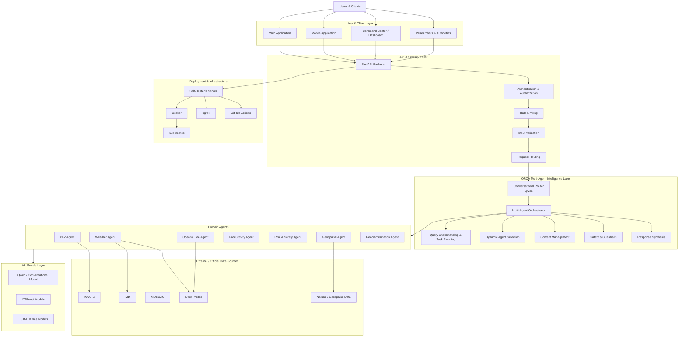

# ORCA — Marine EcOsystem Reasoning with Collaborative Agents

> **From fragmented marine data to intelligent, constraint-aware decisions.**

ORCA is a modular multi-agent marine intelligence platform developed for **Smart India Hackathon 2026 — Problem Statement SIH26176**. It combines conversational AI, specialized marine AI/ML models, geospatial reasoning, multi-source data integration, and deterministic safety constraints to turn complex marine information into actionable, evidence-backed recommendations.

**Team:** Code Newbies_TS16  
**Team ID:** 152277  
**Problem Statement:** SIH26176 — *ORCA Marine EcOsystem Reasoning with Collaborative Agents*  
**Theme:** Space Technology  
**Category:** Software

---

## 🌊 The Problem

Marine decision-making is difficult because useful information is fragmented across different sources, formats, models, and operational systems.

ORCA is designed around five key challenges:

- **Scattered marine data** — information is distributed across multiple marine, weather, satellite, and geospatial sources.
- **High operational risk** — changing weather, strong currents, waves, and natural hazards can rapidly affect maritime operations.
- **Limited actionable insight** — raw environmental data is difficult to translate into practical decisions.
- **Poor connectivity at sea** — intermittent connectivity makes lightweight, accessible interfaces important.
- **Language and literacy barriers** — marine users may communicate through different local languages and conversational forms.

## 🧭 The ORCA Approach

ORCA follows a reasoning pipeline that converts a natural-language request into a coordinated, constraint-aware decision:

```text
User Query
    │
    ▼
┌───────────────────────┐
│  1. ASK               │
│  Natural-language     │
│  voice / text input   │
└───────────┬───────────┘
            ▼
┌───────────────────────┐
│  2. DATA INTEGRATION  │
│  Multi-source marine  │
│  and environmental    │
│  information          │
└───────────┬───────────┘
            ▼
┌───────────────────────┐
│  3. UNDERSTAND        │
│  Intent, location,    │
│  time, activity and   │
│  context extraction   │
└───────────┬───────────┘
            ▼
┌───────────────────────┐
│  4. ANALYZE           │
│  Weather, ocean, PFZ, │
│  risk & geospatial    │
│  reasoning            │
└───────────┬───────────┘
            ▼
┌───────────────────────┐
│  5. VALIDATE & DECIDE │
│  Safety rules and     │
│  operational          │
│  constraints          │
└───────────┬───────────┘
            ▼
┌───────────────────────┐
│  6. RESPOND           │
│  Localized, actionable│
│  evidence-backed      │
│  recommendation       │
└───────────────────────┘
```

The system is intended to combine multiple marine information sources and specialized agents rather than relying on a single general-purpose model for every decision.

---

## 🧠 Key Differentiators

| Capability | ORCA |
|---|---|
| Context-aware interaction | Understands user intent and context |
| Dynamic agent selection | Invokes only relevant domain agents |
| Multi-source marine context | Combines environmental and marine information |
| Constraint-gated decisions | Validates recommendations against safety rules and official advisories |
| Evidence-backed recommendations | Provides key data and reasoning behind decisions |
| Spatial-temporal reasoning | Considers location, time, and marine context |
| Marine risk assessment | Evaluates operational marine hazards |
| Geofencing & route reasoning | Supports spatial constraints and route analysis |
| Multilingual interaction | Designed for English, Bengali, and Hinglish interactions |

---

# 🏗️ System Architecture

The ORCA platform is organized into separate layers so that the API/backend, reasoning engine, domain intelligence, models, and deployment infrastructure can evolve independently.



> **Implementation note:** The two major repositories currently documented in the ORCA organization have distinct responsibilities. `backend` provides the HTTP/API layer, authentication, sessions, rate limiting, and Supabase integration, while `agent-orchestration` contains the conversational routing, DAG-based orchestration, domain agents, marine ML inference, and safety logic.

---

# 🔗 Repository Architecture

## `backend-ORCA`

The API gateway component of ORCA.

Its responsibilities include:

- FastAPI HTTP endpoints
- JWT authentication
- Rate limiting
- In-memory conversational session management
- Supabase/PostgreSQL access
- Request validation
- Backend observability and latency reporting
- Delegation of natural-language queries to the orchestration engine

The backend currently exposes verified endpoints including:

```text
GET  /api/v1/health
POST /api/v1/orca/query
POST /api/v1/orca/command-center/query
GET  /api/v1/orca/sessions/{session_id}/history
```

The command-center endpoint is a prototype endpoint and is disabled by default.

## `agent-orchestration`

The reasoning and multi-agent intelligence component.

Its responsibilities include:

- Qwen-based conversational routing
- Intent, location, temporal and activity extraction
- QueryPlan construction
- DAG-based agent orchestration
- Concurrent execution of domain agents
- Marine risk assessment
- PFZ analysis
- Weather and ocean analysis
- Geospatial reasoning
- Safety rules and constraint arbitration
- Recommendation synthesis
- Multilingual response generation

The repository currently provides a standalone CLI interface through `chat.py`.

---

# 🤖 Multi-Agent Intelligence

ORCA decomposes marine reasoning into specialized domain agents rather than requiring one model to perform every task.

| Agent / Domain | Role |
|---|---|
| **Weather Agent** | Weather conditions, forecasts and weather-risk analysis |
| **Ocean / Tide Agent** | Ocean state, waves, SST and tidal conditions |
| **PFZ Agent** | Potential Fishing Zone discovery and scoring |
| **Productivity Agent** | Environmental fish-productivity forecasting |
| **Risk Agent** | Combined marine-risk assessment |
| **Marine Safety Agent** | Severe operational and marine safety conditions |
| **Safety Rule Agent** | Deterministic safety constraints and validation |
| **Geospatial Agent** | Location, spatial constraints and route-related reasoning |
| **Recommendation Agent** | Synthesizes domain results into an actionable recommendation |

The orchestration engine resolves dependencies between agents and executes the required subset according to the query plan.

---

# 🧠 AI / ML Stack

ORCA combines conversational AI with specialized predictive models.

| Layer | Technology | Role |
|---|---|---|
| Conversational reasoning | **Qwen** | Natural-language understanding, routing and response synthesis |
| PFZ scoring | **XGBoost** | Potential Fishing Zone scoring |
| Weather risk | **XGBoost** | Weather hazard assessment |
| Marine risk | **XGBoost** | Overall marine-risk assessment |
| Ocean suitability | **XGBoost** | Ocean-condition suitability scoring |
| Productivity | **LSTM** | Environmental fish-productivity forecasting |

The current `agent-orchestration` implementation contains the domain-specific model inference, while `backend` delegates reasoning requests to that layer.

---

# 🌐 Data Ecosystem

ORCA is designed around multi-source marine intelligence.

### Direct / documented sources

| Source | Role |
|---|---|
| **INCOIS** | Potential Fishing Zone and marine advisory information |
| **IMD** | Weather warnings, coastal bulletins and cyclone-related information |
| **Open-Meteo** | Weather / marine forecast and fallback information |
| **MOSDAC** | Satellite / marine data source represented in the broader technical architecture |
| **Geospatial datasets** | Spatial and geographic reasoning |

The current repository implementations distinguish between data sources that are directly consumed by a component and sources accessed by delegated domain agents.

For example, `backend` directly uses Supabase for database-backed state and observations, while the live INCOIS/IMD/Open-Meteo integrations are handled by the domain/orchestration layer.

---

# 🛡️ Constraint-Aware Decision Making

A central design principle of ORCA is that conversational AI should not be the sole authority for safety-critical recommendations.

The reasoning flow separates interpretation from validation:

```text
Natural-Language Query
        ↓
LLM-based Understanding
        ↓
Structured Query Plan
        ↓
Relevant Domain Agents
        ↓
Environmental & Marine Evidence
        ↓
Risk Assessment
        ↓
Deterministic Safety Rules
        ↓
Constraint Arbitration
        ↓
Final Recommendation
```

This enables ORCA to combine learned models with explicit operational constraints.

Where catastrophic conditions are detected, the safety layer can override an otherwise favorable recommendation and issue a safety-oriented response such as **RETURN TO HARBOR**.

---

# 📍 Example ORCA Use Cases

ORCA is designed to support questions such as:

```text
"Is it safe to go fishing near Digha tomorrow?"
```

```text
"Where is the nearest Potential Fishing Zone today?"
```

```text
"Which fishing areas should be avoided because of hazardous marine conditions?"
```

```text
"What is the safest route for a fishing vessel considering
weather and sea-state conditions?"
```

```text
"Why has fish productivity declined in this coastal region?"
```

```text
"I want to go on a fishing trip near Kochi. What areas
should I consider?"
```

The actual agents selected and executed depend on the query's intent, location, time and required reasoning.

---

# 📊 Evidence-Backed Recommendations

ORCA is designed to provide more than a final label or recommendation.

The response can include supporting information such as:

- Weather conditions
- Ocean state
- Wave / wind conditions
- Marine risk
- PFZ information
- Geospatial constraints
- Official warning/advisory information
- Agent-level evidence
- Reasoning behind the resulting recommendation

This is intended to make recommendations inspectable rather than presenting an unexplained output.

---

# 🌍 Multilingual & Accessible Interaction

The ORCA technical approach supports conversational interaction in:

- English
- Bengali
- Hinglish

The orchestration layer extracts intent and context from natural-language queries and generates localized responses.

The SIH solution concept also emphasizes voice/text interaction and accessibility for users operating with limited connectivity or different levels of technical literacy.

---

# 🚀 Deployment & Integration

The SIH technical architecture proposes a modular deployment model that can support:

- Docker-based containerization
- Kubernetes orchestration
- Self-hosted or server-based deployment
- GitHub Actions for CI/CD
- ngrok for exposing development services
- Web and mobile clients

The current repositories should be distinguished from the broader deployment architecture shown in the SIH presentation: some deployment elements represent the proposed/scalable architecture rather than functionality contained in the two repositories documented here.

---

# 🔬 Research & Technical Foundation

The SIH presentation compares ORCA's intended capabilities with existing marine/weather systems and highlights areas such as:

- Uncertainty quantification
- Real-time data assimilation
- Domain-specific data processing
- Spatial-temporal reasoning
- Specialized AI/ML
- Multi-source fusion
- Natural-language interaction
- Explainable recommendation
- Multi-agent orchestration
- Marine risk assessment
- Geofencing
- Route optimization

The presentation also cites research covering machine learning for ocean data assimilation, probabilistic weather forecasting, data assimilation for ocean forecasting, OceanGPT, medium-range global weather forecasting, FourCastNet, and vessel safety/risk systems.

---

# 📚 Research References

References included in the SIH presentation:

1. D. Grande, R. Buizza, and A. Storto, *Machine learning in ocean data assimilation: Advances, gaps and the road to operations*, Ocean Modelling, vol. 200, 102676, 2026.
2. I. Price, A. Sanchez-Gonzalez, F. Alet, et al., *Probabilistic weather forecasting with machine learning*, Nature, vol. 637, pp. 84–90, 2025.
3. M. J. Martin, L. Floet, I. Bertino, and A. M. Moore, *Data assimilation schemes for ocean forecasting: State of the art*, State of the Planet, vol. 5, 2025.
4. Z. Bi, N. Zhang, Y. Xue, Y. Du, D. Ji, G. Zheng, and H. Chen, *OceanGPT: A Large Language Model for Ocean Science Tasks*, Proceedings of ACL, 2024.
5. K. Bi, L. Xie, H. Zhang, X. Chen, X. Gu, and Q. Tian, *Accurate medium-range global weather forecasting with 3D neural networks*, Nature, vol. 619, pp. 533–538, 2023.
6. J. Pathak, S. Subramanian, P. Harrington, et al., *FourCastNet: A Global Data-driven High-resolution Weather Model using Adaptive Fourier Neural Operators*, 2022.
7. T. M. Balakrishnan Nair, et al., *Development of small vessel advisory and forecast services system for safe navigation and operations at sea*, Journal of Operational Oceanography, 2020.

---

# 🌱 Feasibility & Viability

The proposed ORCA architecture is designed around:

### Technical Feasibility
- Modular architecture
- Independent agent integration
- Python-based model integration
- Existing open/government data sources

### Data Feasibility
- Trusted open and government datasets
- Real-time data availability where supported
- Multi-source marine information

### Economic Feasibility
- Open-source technologies
- Existing infrastructure
- Cost-conscious deployment

### Operational Feasibility
- API-first integration
- Web/mobile accessibility
- Modular backend architecture

### Viability
The SIH proposal identifies potential value across:

- **Fishermen** — fishing-zone intelligence and safety information
- **Authorities** — timely alerts and data-driven decision support
- **Businesses** — operational and route optimization
- **Coastal communities** — early information and preparedness
- **Researchers & students** — unified access to multi-source marine information

---

# 🌊 Intended Impact

> **Smarter Decisions. Safer Seas. Stronger Communities.**

The proposed impact areas include:

- Safer and more informed fishing decisions
- Early awareness of marine hazards
- More efficient maritime operations
- Better route and spatial planning
- Improved access to integrated marine information
- Support for coastal preparedness
- Easier access to complex environmental information
- A foundation for further marine research and decision-support systems

These represent the intended impact of the ORCA solution; actual operational outcomes depend on deployment, data availability, validation, and user adoption.

---

# 🗂️ ORCA Repository Map

The organization is structured around separate components rather than placing the complete system into a single repository.

| Repository | Primary Responsibility |
|---|---|
| `backend` | FastAPI gateway, authentication, sessions, rate limiting and Supabase integration |
| `agent-orchestration` | Conversational routing, multi-agent orchestration, domain agents, ML inference and safety logic |

Additional repositories/components can be added to this map as the ORCA platform evolves.

---

# ⚠️ Current Implementation Scope

The organization contains a working prototype architecture, but the current repositories should be distinguished from the complete long-term architecture presented in the SIH proposal.

In particular:

- `backend` currently provides the HTTP/API layer and depends on the sibling `agent-orchestration` repository.
- `agent-orchestration` currently provides the standalone CLI reasoning/orchestration interface.
- Some external providers are configurable or delegated to the orchestration layer.
- The backend currently uses in-memory session state with Supabase persistence support.
- The orchestration layer uses local ML models and external marine data integrations.
- The complete production-scale deployment architecture shown in the SIH presentation is a broader target architecture rather than a claim that every component is already contained in these two repositories.

This distinction keeps the organization documentation aligned with the implemented repositories while preserving the broader ORCA system vision.

---

# 👥 Team

**Code Newbies_TS16**

**Smart India Hackathon 2026**  
Problem Statement: **SIH26176**  
Team ID: **152277**

---

## ORCA

**Marine EcOsystem Reasoning with Collaborative Agents**

> From fragmented marine data to intelligent, constraint-aware decisions.

